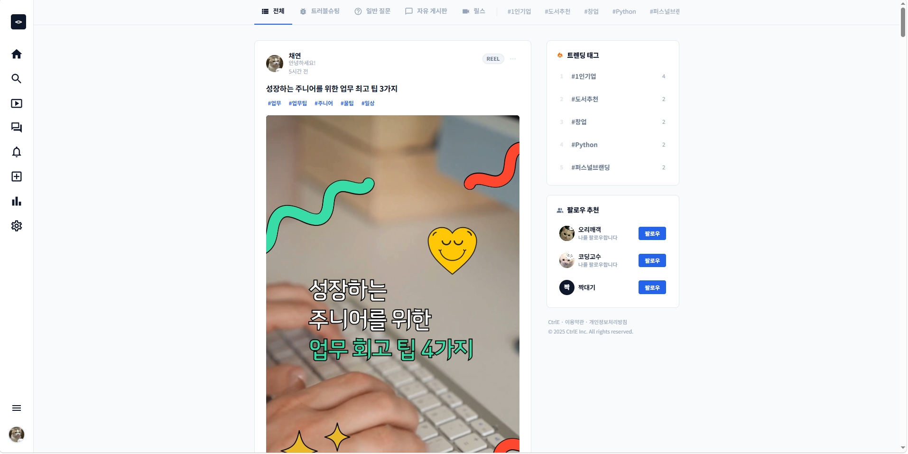
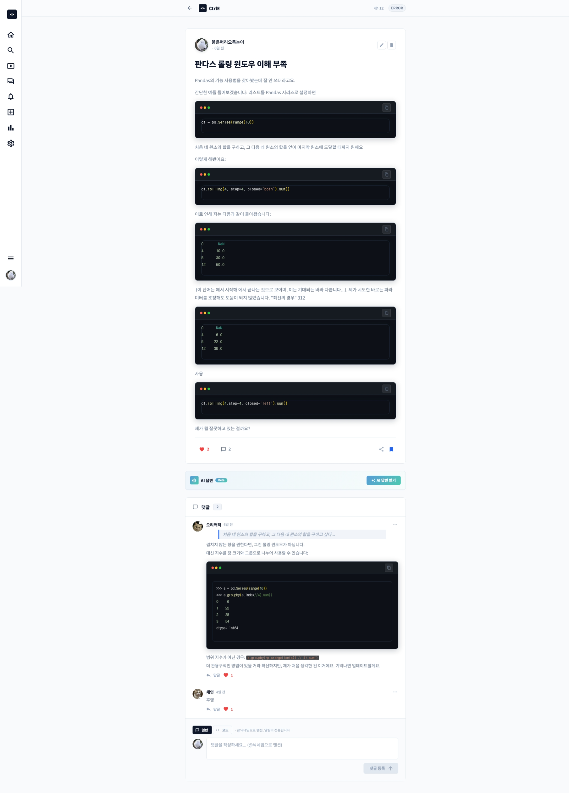
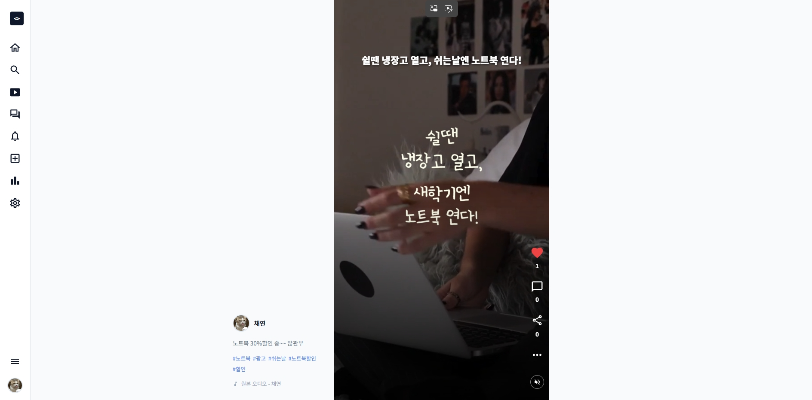
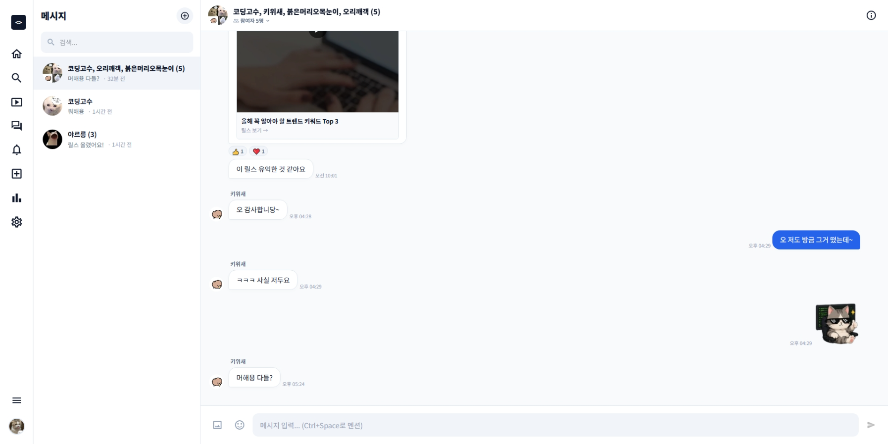

# CtrlE — 개발자 중심 SNS 플랫폼

> 코드 공유, 소통, 협업을 위한 개발자 전용 소셜 네트워크 서비스

<br/>

<!-- 대표 이미지를 여기에 삽입하세요! (예: ./assets/main_banner.png) -->
> 🖼️ **[여기에 대표 이미지를 넣으세요! (배너 또는 메인 화면 캡처 권장)]**

<br/>

## 📌 프로젝트 소개

**CtrlE**는 개발자들이 코드와 기술을 중심으로 소통할 수 있는 SNS 플랫폼입니다.  
게시물 작성, 릴스, 실시간 채팅, 알림, 팔로우 시스템 등 SNS의 핵심 기능을 제공하며,  
코드 하이라이팅, 마크다운 에디터, GitHub 소셜로그인 연동 등 개발자 특화 기능을 갖추고 있습니다.

> 💡 **개인 프로젝트**로 기획부터 설계, 개발까지 혼자 진행하였습니다.

<br/>

## 🗓 개발 기간 및 업무

| 기간 | 업무 내용 |
|------|-----------|
| 1주차 | 기획, 요구사항 분석, DB 설계, 화면 설계 |
| 2주차 | 백엔드 기본 구조 세팅, 인증(JWT, OAuth) 구현 |
| 3주차 | 피드, 게시물 CRUD, 댓글, 좋아요, 북마크 기능 개발 |
| 4주차 | 채팅(1:1, 그룹), 알림, 릴스 기능 개발 |
| 5주차 | 탐색/검색, 마이페이지, 설정, 관리자 기능 개발 |
| 6주차 | UI 다듬기, 다크모드, 버그 수정, 배포 준비 |

> 📅 **[여기에 실제 개발 기간을 명시하세요! 예: 2025.03.01 ~ 2025.04.15]**

<br/>

## 👤 팀원 구성

| 이름 | 역할 |
|------|------|
| **[본인 이름을 넣으세요!]** | 기획 · 설계 · 프론트엔드 · 백엔드 전체 (개인 프로젝트) |

<br/>

## 🛠 기술 스택

### Frontend
| 분류 | 기술 |
|------|------|
| Framework | React 18 |
| UI Library | MUI (Material UI) v6 |
| Routing | React Router DOM v6 |
| Editor | Tiptap, Monaco Editor, React Quill, SimpleMDE |
| HTTP | Axios |
| 기타 | Highlight.js, Lowlight, Emotion |

### Backend
| 분류 | 기술 |
|------|------|
| Runtime | Node.js |
| Framework | Express v5 |
| Database | Oracle DB (oracledb v6) |
| 인증 | JWT, Passport.js |
| 파일 업로드 | Multer |
| 메일 | Nodemailer |
| AI | Google Gemini API (`@google/genai`) |
| OAuth | Google OAuth 2.0, GitHub OAuth 2.0 |
| 기타 | bcrypt, QRCode, dotenv |

<br/>

## 🎬 발표 PPT 및 시연 영상

| 구분 | 링크 |
|------|------|
| 📊 발표 PPT | **[여기에 PPT 링크를 넣으세요! (Google Drive 등)]** |
| 🎥 시연 영상 | [](https://youtu.be/du_X_FnkvBA) |

<br/>

## ✨ 주요 기능

### 👤 사용자
- 이메일 회원가입 / 로그인
- Google, GitHub 소셜 로그인 (OAuth 2.0)
- 프로필 편집 (아바타, 소개, GitHub 연동, 웹사이트)
- 계정 공개/비공개 설정
- 팔로우 / 팔로워 시스템

### 📝 게시물
- 마크다운 / 리치 텍스트 에디터로 게시물 작성
- 코드 블록 하이라이팅 (Monaco Editor, Tiptap)
- 이미지 / 동영상 첨부
- 좋아요, 댓글, 북마크, 공유
- 게시물 카테고리 / 태그
- 멘션 (`@닉네임`) 기능

### 🎬 릴스
- 동영상 업로드 및 피드 형태 재생
- 좋아요, 댓글 지원

### 💬 채팅
- 1:1 다이렉트 메시지
- 그룹 채팅방 (이름, 사진 커스텀)
- 이미지 / 파일 전송
- 이모티콘, 스티커
- 메시지 수정 / 삭제 (나만 / 모두에게)
- 리액션 (이모지)
- 읽음 표시
- 타이핑 인디케이터
- 채팅방 배경색 / 말풍선 스타일 커스텀
- 알림 음소거

### 🔔 알림
- 좋아요, 댓글, 팔로우, 멘션 알림
- 읽음 처리

### 🔍 탐색
- 유저 / 게시물 검색
- 카테고리별 탐색

<br/>

## 📸 화면 구성

| 로그인 | 회원가입 |
|--------|--------|
|  |  |

| 피드 | 게시물 상세 |
|------|-----------|
|  |  |

| 탐색 | 릴스 |
|------|------|
|  |  |

| 메시지 | 알림 |
|--------|------|
|  |  |

| 마이페이지 | 유저 프로필 |
|-----------|-----------|
|  |  |

| 게시물 등록 | 내 활동 |
|-----------|--------|
|  |  |

| 설정 | 다크모드 |
|------|--------|
|  |  |

<br/>

## 📎 기타 산출물

| 구분 | 링크 |
|------|------|
| 📐 설계 자료 (ERD, 화면설계서 등) | **[여기에 Google Drive 링크를 넣으세요!]** |
| 📊 발표 PPT | **[여기에 PPT 링크를 넣으세요!]** |
| 🎥 시연 영상 | [YouTube 바로가기](https://youtu.be/du_X_FnkvBA) |

<br/>

## 🚀 실행 방법

### 백엔드
```bash
cd back
npm install
npm run dev       # nodemon 사용
# 또는
node app.js
```

### 프론트엔드
```bash
cd front
npm install
npm start
```

> 백엔드는 `http://localhost:3010`, 프론트엔드는 `http://localhost:3000` 에서 실행됩니다.

<br/>

## 🗄 데이터베이스

Oracle DB를 사용합니다. 주요 테이블 목록:

| 테이블 | 설명 |
|--------|------|
| USERS | 사용자 계정 |
| POSTS | 게시물 |
| COMMENTS | 댓글 |
| FOLLOWS | 팔로우 관계 |
| NOTIFICATIONS | 알림 |
| CHAT_ROOMS | 채팅방 |
| CHAT_MEMBERS | 채팅방 참여자 |
| CHAT_MESSAGES | 채팅 메시지 |
| CHAT_REACTIONS | 메시지 리액션 |
| BOOKMARKS | 북마크 |
| POST_LIKES | 좋아요 |
| TAGS / POST_TAGS | 태그 |
| BLOCKS | 차단 |
| MUTES | 뮤트 |

<br/>

## 📡 API 엔드포인트 요약

| 메서드 | 경로 | 설명 |
|--------|------|------|
| POST | `/api/auth/google` | Google 로그인 |
| POST | `/api/auth/github` | GitHub 로그인 |
| GET | `/user/mypage/data` | 내 프로필 조회 |
| PUT | `/user/profile` | 프로필 수정 |
| GET | `/feed` | 피드 조회 |
| GET | `/explore` | 탐색 |
| GET | `/messages/rooms` | 채팅방 목록 |
| GET | `/messages/:roomId` | 채팅방 메시지 |
| GET | `/notifications` | 알림 목록 |
| PUT | `/notifications/read` | 알림 읽음 처리 |
| GET | `/reels` | 릴스 목록 |
| GET | `/activity` | 내 활동 |

<br/>

## 📁 프로젝트 구조

```
/
├── assets/                      # 스크린샷 이미지
├── back/                        # 백엔드 (Node.js + Express)
│   ├── middlewares/
│   │   ├── auth.js              # JWT 인증 미들웨어
│   │   └── upload.js            # Multer 파일 업로드
│   ├── routes/
│   │   ├── auth.js              # 소셜 로그인 (Google, GitHub)
│   │   ├── user.js              # 유저 프로필, 팔로우
│   │   ├── feed.js              # 피드, 게시물 CRUD
│   │   ├── messages.js          # 채팅 (1:1, 그룹)
│   │   ├── notifications.js     # 알림
│   │   ├── explore.js           # 탐색 / 검색
│   │   ├── reels.js             # 릴스 (동영상)
│   │   └── activity.js          # 내 활동
│   ├── uploads/                 # 업로드 파일 저장소
│   ├── app.js                   # 서버 진입점
│   ├── db.js                    # Oracle DB 연결
│   └── passport.js              # OAuth 설정
│
└── front/                       # 프론트엔드 (React)
    └── src/
        ├── components/
        │   ├── Feed.js          # 피드
        │   ├── Messages.js      # 채팅
        │   ├── MyPage.js        # 마이페이지
        │   ├── Explore.js       # 탐색
        │   ├── Reels.js         # 릴스
        │   ├── PostDetail.js    # 게시물 상세
        │   ├── RegisterModal.js # 게시물 등록
        │   ├── Settings.js      # 설정
        │   └── ...
        └── App.js               # 라우팅 및 테마 설정
```
